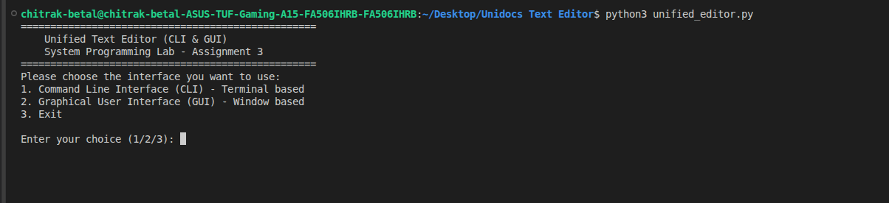
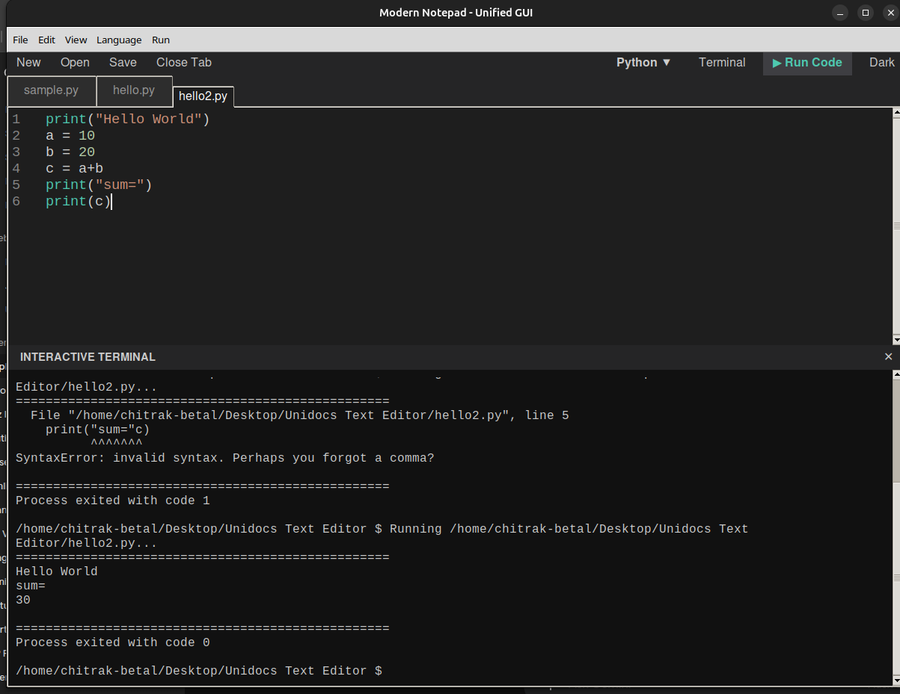
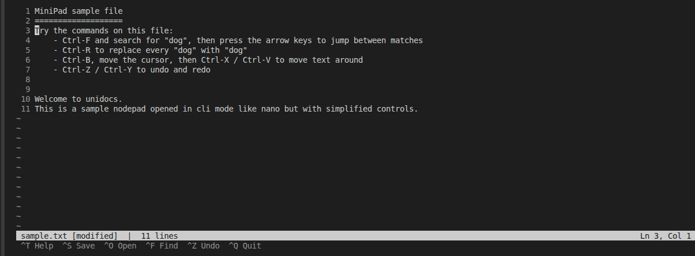

# Unidocs Text Editor

<p align="center">
  A dual-mode text editor for the terminal and desktop.
</p>

<p align="center">
  
  
  
</p>

Unidocs Text Editor is a System Programming Lab project that offers two ways to work with text files: a responsive **C terminal editor** and a modern **Python/Tkinter graphical editor**. The `unified_editor.py` launcher lets you choose the experience that fits your workflow.

## Highlights

| Terminal editor | Graphical editor |
| --- | --- |
| Full-screen raw-terminal experience | Multi-tab desktop workspace |
| Built in C for a lightweight native workflow | Built with Python and Tkinter |
| Find, replace, selection, and undo/redo | Syntax highlighting and line numbers |
| Open, save, save as, file statistics, and run support | Themes, font controls, terminal panel, and run support |

## Screenshots

### Choose an editor

Run the unified launcher to select the terminal or graphical interface.

<p align="center">
  
</p>

### Graphical editor

The GUI provides tabs, language-aware syntax highlighting, line numbers, an integrated terminal panel, and one-click code execution.

<p align="center">
  
</p>

### Terminal editor

The CLI editor provides a focused full-screen editing environment with line numbers, a status bar, and keyboard-driven controls.

<p align="center">
  
</p>

## Feature guide

### 1. Unified launcher

`unified_editor.py` is the project entry point. It presents a simple menu for choosing the CLI or GUI editor, or it can launch either mode directly with `--cli` or `--gui`. When CLI mode is selected, the launcher checks for the compiled editor and invokes `make` automatically if it is missing.

This keeps the C and Python implementations independent while providing one consistent way to start the project.

### 2. File management

Both interfaces support the everyday file workflow: creating a document, opening an existing file, saving changes, and saving to a new path.

- The **CLI editor** opens a filename supplied at launch or lets you enter a filename through its in-editor Open command. It reports useful status messages, including the number of bytes written after a successful save.
- The **GUI editor** opens each file in its own tab. Untitled files can be saved through the native Save As dialog, and closing the last tab automatically opens a fresh blank document so the workspace is always ready to use.

### 3. Text editing, selection, and history

The project supports the core editing actions expected from a notepad-style editor: typing, inserting new lines and tabs, deleting text, and clipboard operations.

- In the **CLI**, selection mode allows a range of text to be marked with the keyboard before copying or cutting it. If no range is selected, copy and cut operate on the current line. The editor stores up to 100 buffer snapshots for undo and redo, grouping consecutive typing or erasing actions into practical history steps.
- In the **GUI**, Tkinter's text widget provides undo, cut, copy, and paste actions. These are available through standard keyboard shortcuts such as `Ctrl+Z`, `Ctrl+X`, `Ctrl+C`, and `Ctrl+V`.

### 4. Find, replace, and navigation

The CLI editor includes a keyboard-driven find dialog with next/previous match navigation, an all-occurrences replace command, and a Go To Line prompt. It also supports arrow keys, Home, End, Page Up, and Page Down for efficient movement in larger files.

The GUI has an in-editor find/replace bar. Searching is case-insensitive, highlights the next match after the cursor, moves the insertion point to that match, and lets you replace the highlighted result without leaving the editor.

### 5. Code-aware editing and syntax highlighting

The graphical editor can set a document's language manually or infer it from its filename extension. Supported modes are Plain Text, Python, C, C++, Java, JavaScript, and HTML.

For supported code files, the editor applies lightweight highlighting to keywords, built-ins, strings, comments, and numbers. This is designed to make source files easier to scan while keeping the application fast and dependency-free.

### 6. Run code and use the integrated terminal

The GUI can run the active saved file and shows standard output, errors, and the process exit code in its integrated terminal panel. It supports:

- Python with `python3`
- C with `gcc`
- C++ with `g++`
- Java with `javac` and `java`
- JavaScript with `node`

The terminal panel also accepts shell commands and supports changing its working directory with `cd`. Commands run from the directory of the currently open file, helping programs locate related project files.

The CLI editor also offers a Run command for supported source files, making it possible to edit and test code without leaving the terminal workflow.

### 7. Interface and workspace tools

The **CLI editor** uses raw terminal mode and ANSI escape sequences to provide a full-screen editing view with line numbers, a status area, visual search results, and terminal-resize handling. It runs in an alternate terminal screen, so exiting returns you to the original shell view.

The **GUI editor** provides a multi-tab workspace with a line-number gutter, a scrollable editor area, and a live status bar showing the cursor line, column, word count, and current language. You can switch between dark and light themes, choose a font family and size, and show or hide the integrated terminal to focus on the task at hand.

### Feature availability

| Capability | CLI | GUI |
| --- | :---: | :---: |
| Open, Save, Save As | ✓ | ✓ |
| Multi-file tabs | — | ✓ |
| Undo and redo | ✓ | ✓ |
| Cut, copy, and paste | ✓ | ✓ |
| Find and replace | ✓ | ✓ |
| Go to line | ✓ | — |
| Syntax highlighting | — | ✓ |
| Run source files | ✓ | ✓ |
| Interactive terminal | — | ✓ |
| Themes and font controls | — | ✓ |

## Project structure

```text
Unidocs Text Editor/
├── Assets/
│   ├── cli.png           # Terminal editor screenshot
│   ├── gui.png           # Graphical editor screenshot
│   └── interface.png     # Launcher screenshot
├── unified_editor.py     # Main launcher for CLI and GUI modes
├── gui_editor.py         # Tkinter GUI editor implementation
├── cli_editor.c          # C terminal editor implementation
├── Makefile              # Build rules for the CLI editor
├── sample.txt            # Example text file
└── README.md             # Project documentation
```

## Requirements

- Linux, macOS, or another Unix-like system for the terminal editor
- A C compiler, such as `gcc` or `clang`
- `make`
- Python 3
- Tkinter for the GUI (`python3-tk` package on Debian/Ubuntu)

On Debian or Ubuntu, install the requirements with:

```bash
sudo apt update
sudo apt install build-essential make python3 python3-tk
```

## Getting started

Clone the project or open its directory, then run:

```bash
python3 unified_editor.py
```

Select one of the displayed options:

1. Command Line Interface (CLI)
2. Graphical User Interface (GUI)
3. Exit

You can also launch a mode directly:

```bash
# Start the graphical editor
python3 unified_editor.py --gui

# Start the terminal editor
python3 unified_editor.py --cli

# Open a file in the terminal editor
python3 unified_editor.py --cli sample.txt
```

## Build the terminal editor directly

```bash
make
./cli_editor sample.txt
```

Remove the compiled binary when needed:

```bash
make clean
```

## Keyboard shortcuts

### CLI editor

Press `Ctrl+T` inside the editor for the built-in help screen.

| Shortcut | Action |
| --- | --- |
| `Ctrl+S` / `Ctrl+W` | Save / Save As |
| `Ctrl+N` / `Ctrl+O` | New file / Open file |
| `Ctrl+Q` | Quit |
| `Ctrl+F` / `Ctrl+R` / `Ctrl+G` | Find / Replace / Go to line |
| `Ctrl+Z` / `Ctrl+Y` | Undo / Redo |
| `Ctrl+C` / `Ctrl+X` / `Ctrl+V` | Copy / Cut / Paste |
| `Ctrl+B` / `Ctrl+A` | Toggle selection / Select all |
| `Ctrl+E` / `Ctrl+P` | File statistics / Run current file |

### GUI editor

| Shortcut | Action |
| --- | --- |
| `Ctrl+N` / `Ctrl+O` / `Ctrl+S` | New tab / Open file / Save |
| `Ctrl+W` | Close tab |
| `Ctrl+F` | Find and replace |
| `Ctrl+R` or `F5` | Run current file |
| `Ctrl+Z` | Undo |
| `Ctrl+X` / `Ctrl+C` / `Ctrl+V` | Cut / Copy / Paste |

## Upload to GitHub

First create a new **empty** repository on GitHub. Then, from this project folder, run the following commands. Replace `YOUR-USERNAME` and `YOUR-REPOSITORY` with your GitHub details.

```bash
cd "/home/chitrak-betal/Desktop/Unidocs Text Editor"
git init
git add .
git commit -m "Initial commit: Unidocs Text Editor"
git branch -M main
git remote add origin https://github.com/YOUR-USERNAME/YOUR-REPOSITORY.git
git push -u origin main
```

If GitHub asks you to authenticate, sign in through the browser or use a GitHub personal access token instead of a password.

## License

This project is intended for academic and learning use.
